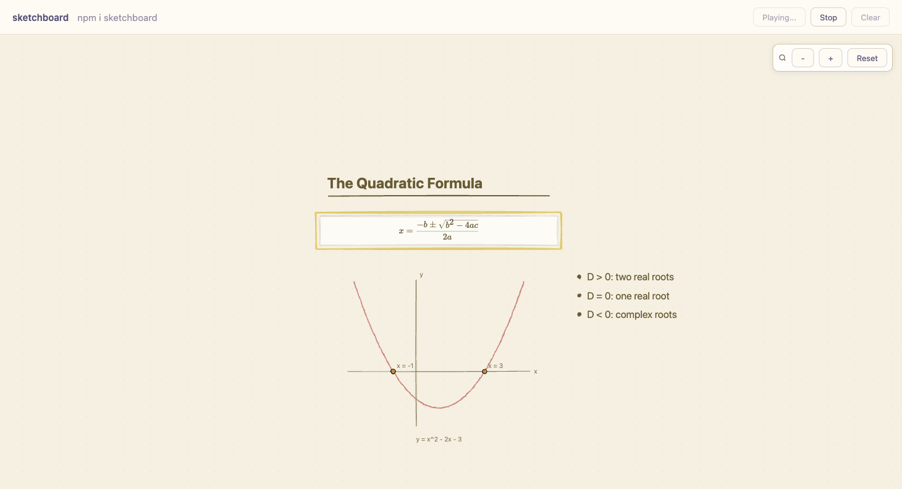

# sketchboard

<div align="center">

**An open-source engine that lets AI agents create interactive, audio-synced whiteboard explanations, no spatial reasoning required.**

[](https://www.npmjs.com/package/sketchboard)
[](LICENSE)
[](#)

</div>

---



*A lesson rendered purely from semantic actions: no coordinates, no layout code.*

---

## The Problem

LLMs are great at generating text. But when you ask them to "draw a diagram" or "create an interactive explanation," they struggle:

- **No spatial understanding**: models can't reason about canvas coordinates, layout, or visual hierarchy
- **No timing**: synchronizing visuals with audio narration is error-prone
- **No animation**: revealing content step-by-step requires complex state management
- **No extensibility**: existing tools lock you into their built-in visualizations

**Sketchboard solves all of this.** Give your AI a semantic action DSL, and the library handles layout, collision, animation, camera, and audio sync automatically.

## Key Features

| Feature | Description |
|---------|-------------|
| **Semantic Positioning** | Use `below:title`, `right-of:diagram`, `center`. No pixel coordinates |
| **Audio-First Sync** | Actions sync to audio timeline automatically, not the other way around |
| **Step-wise Reveal** | Progressive content reveal with `sequential`, `parallel`, `stagger`, or `manual` modes |
| **Custom Actions** | First-class extensibility, build any visualization as a React component |
| **Theming** | Full theme tokens for light/dark modes, completely customizable |
| **Camera Control** | Smart zoom-to-fit, highlight focus, never clips content |
| **TypeScript First** | Full type safety, JSON schemas for agent integration |
| **Deterministic Layout** | Same input always produces the same visual output |

## Quick Start

### Install

```bash
npm install sketchboard
```

**Peer dependencies:**
- `react >= 18`
- `react-dom >= 18`
- `@xyflow/react >= 12`

### Basic Usage

```tsx
'use client';

import { SketchboardProvider, TutorCanvas, useSketchboardLive } from 'sketchboard';

function LessonControls() {
  const { play, resume } = useSketchboardLive();

  const runLesson = async () => {
    resume();
    await play({
      audio: {
        data: '<base64-encoded-audio>',
        encoding: 'mp3',
      },
      actions: [
        {
          type: 'create_block',
          ref: 'title',
          block_type: 'title',
          content: 'Quadratic Formula',
          position: 'center',
        },
        {
          type: 'create_block',
          ref: 'formula',
          block_type: 'formula',
          content: 'x = \\frac{-b \\pm \\sqrt{b^2 - 4ac}}{2a}',
          position: 'below:title',
        },
        {
          type: 'draw_diagram',
          ref: 'parabola',
          diagram_type: 'cartesian',
          position: 'below:formula',
          data: {
            function: 'x^2 - 2x - 3',
            xRange: [-3, 5],
            yRange: [-5, 10],
          },
        },
        {
          type: 'highlight',
          ref: 'highlight_formula',
          target: 'formula',
          color: 'highlight',
        },
      ],
    });
  };

  return <button onClick={runLesson}>Play Lesson</button>;
}

export default function Page() {
  return (
    <SketchboardProvider>
      <div style={{ width: '100%', height: '600px' }}>
        <TutorCanvas />
      </div>
      <LessonControls />
    </SketchboardProvider>
  );
}
```

## Built-in Actions

### Text Blocks

```ts
{
  type: 'create_block',
  block_type: 'title' | 'body' | 'theorem' | 'formula' | 'bullet_list' | 'note' | 'definition' | 'code',
  content: 'Your content here',
  position: 'center',
  size: 'medium', // 'small' | 'medium' | 'large'
  color: 'primary', // 'primary' | 'accent' | 'highlight' | 'danger'
}
```

**Supported block types:**

| Type | Use Case | Features |
|------|----------|----------|
| `title` | Section headers | Caveat handwriting font, char-reveal animation |
| `body` | Paragraph text | Standard text blocks |
| `theorem` | Theorems, lemmas | Accent border, formal styling |
| `formula` | LaTeX equations | KaTeX rendering, clip-path reveal |
| `bullet_list` | Lists | Uses `items: string[]` instead of `content` |
| `note` | Sticky notes | Rough.js hand-drawn style, color variants |
| `definition` | Term definitions | Highlighted header |
| `code` | Code snippets | Prism.js syntax highlighting |

### Diagrams

```ts
{
  type: 'draw_diagram',
  diagram_type: 'cartesian' | 'geometry' | 'flowchart' | 'venn' | 'bar_chart' | 'pie_chart',
  position: 'below:title',
  data: {
    // Type-specific configuration
  },
}
```

### Highlights

```ts
{
  type: 'highlight',
  target: 'formula', // ref of the node to highlight
  color: 'highlight', // 'primary' | 'accent' | 'highlight' | 'danger'
  padding: 20, // optional extra padding
}
```

## Semantic Positioning

Never compute pixel coordinates. Use semantic references:

```ts
position: 'center'           // Center of canvas
position: 'below:title'      // Below the node with ref='title'
position: 'right-of:diagram' // Right of the node with ref='diagram'
position: 'below:formula'    // Below the formula
```

The layout engine handles collision detection, gap spacing, and camera adjustment automatically.

## Custom Actions

Custom actions are first-class citizens: they go through the same layout, collision, and reveal pipeline as built-ins.

### Defining a Custom Action

```ts
import type { Action } from 'sketchboard';

const stepSolverAction: Action = {
  type: 'custom',
  ref: 'step_solver',
  renderer: 'stepSolver', // Key into your renderer registry
  position: 'below:formula',
  size: { width: 520, height: 400 },
  data: {
    equation: 'x^2 - 2x - 3 = 0',
    steps: [
      { label: 'Identify coefficients', values: 'a=1, b=-2, c=-3' },
      { label: 'Calculate discriminant', values: 'b² - 4ac = 4 + 12 = 16' },
      { label: 'Apply formula', values: 'x = (2 ± 4) / 2' },
      { label: 'Solutions', values: 'x = 3, x = -1', result: 'true' },
    ],
  },
  reveal: {
    mode: 'manual', // User controls step-by-step
  },
};
```

### Size Options

```ts
// Preset sizes
size: 'small'   // 200px width
size: 'medium'  // 320px width (default)
size: 'large'   // 480px width

// Explicit dimensions (safely clamped by engine)
size: { width: 600, height: 400 }
```

### Registering Custom Renderers

```tsx
import type { Renderers, RendererComponent } from 'sketchboard';

const StepSolverRenderer: RendererComponent = ({ data, reveal, controls }) => {
  const payload = data as {
    equation: string;
    steps: Array<{ label: string; values: string; result?: string }>;
  };

  const visibleCount = reveal.complete
    ? payload.steps.length
    : reveal.stepIndex + 1;

  return (
    <div className="step-solver">
      <h3>{payload.equation}</h3>
      {payload.steps.slice(0, visibleCount).map((step, i) => (
        <div key={i} className={`step ${step.result ? 'result' : ''}`}>
          <span className="step-number">{i + 1}.</span>
          <span className="step-label">{step.label}</span>
          <code>{step.values}</code>
        </div>
      ))}
      {reveal.controls && !reveal.complete && (
        <button onClick={reveal.controls.advance}>Next Step</button>
      )}
    </div>
  );
};

const renderers: Renderers = {
  stepSolver: StepSolverRenderer,
};

// Register with provider
<SketchboardProvider renderers={renderers}>
  <TutorCanvas />
</SketchboardProvider>
```

If a renderer key is missing, the canvas shows a non-fatal fallback node.

## Reveal Modes

Control how content appears on the canvas:

| Mode | Behavior | Use Case |
|------|----------|----------|
| `sequential` | One node at a time, in order | Default for lessons |
| `parallel` | All nodes appear immediately | Fast overviews |
| `stagger` | Nodes appear with configurable delay | Dynamic presentations |
| `manual` | User controls reveal step-by-step | Interactive tutorials |

```ts
// Sequential reveal (default)
{ type: 'create_block', ..., reveal: { mode: 'sequential' } }

// Stagger reveal with 200ms delay between nodes
{ type: 'create_block', ..., reveal: { mode: 'stagger', staggerMs: 200 } }

// Manual reveal with markers
{
  type: 'custom',
  renderer: 'stepSolver',
  reveal: {
    mode: 'manual',
    steps: 4,
    markers: [
      { name: 'showHint', at: 0.5 },
      { name: 'showResult', at: 1.0 },
    ],
  },
}
```

### Reveal Props in Custom Renderers

Your custom renderer receives:

```ts
interface RevealState {
  visible: boolean;      // Should this node be rendered?
  started: boolean;      // Has the reveal animation begun?
  progress: number;      // 0 to 1
  complete: boolean;     // Is the reveal done?
  charIndex: number;     // For char-reveal text animations
  stepIndex: number;     // Current step (0-based)
  stepCount: number;     // Total steps
  markers: Record<string, boolean>; // Named marker states
}

interface ManualRevealControls {
  advance: () => void;        // Move to next step
  goToStep: (step: number) => void; // Jump to specific step
  complete: () => void;       // Skip to end
}
```

## Audio Sync

### Audio Formats

`Segment.audio.data` expects **base64-encoded bytes**:

| Encoding | Format | Notes |
|----------|--------|-------|
| `pcm_s16le` | Raw PCM | 16-bit, little-endian, mono |
| `mp3` | MP3 | Standard compressed audio |
| `wav` | WAV | Uncompressed PCM in WAV container |

### Sync Modes

```ts
// Audio-locked (default): action timing follows audio
{ type: 'create_block', ..., sync: { mode: 'audioLocked' } }

// Duration-locked: action takes exactly the specified duration
{ type: 'create_block', ..., sync: { mode: 'durationLocked', durationMs: 3000 } }

// Manual: you control timing yourself
{ type: 'create_block', ..., sync: { mode: 'manual' } }
```

## Theming

Full theme support with light/dark modes:

```tsx
import { SketchboardProvider, lightTheme, darkTheme, createTheme } from 'sketchboard';

// Use built-in themes
<SketchboardProvider theme={darkTheme}>
  <TutorCanvas />
</SketchboardProvider>

// Create custom theme
const myTheme = createTheme({
  colors: {
    primary: '#8b5cf6',
    accent: '#ec4899',
    background: '#fef3c7',
  },
});

<SketchboardProvider theme={myTheme}>
  <TutorCanvas />
</SketchboardProvider>
```

### Theme Tokens

```ts
interface ThemeTokens {
  colors: {
    primary: string;
    accent: string;
    background: string;
    text: string;
    surface: string;
    border: string;
    highlight: string;
    danger: string;
  };
  fonts: {
    body: string;
    heading: string;
    code: string;
  };
  codeBg: string;
  codeText: string;
  note: {
    primary: { bg: string; border: string; text: string };
    accent: { bg: string; border: string; text: string };
    highlight: { bg: string; border: string; text: string };
    danger: { bg: string; border: string; text: string };
  };
  diagramPalette: string[];
  diagramAxis: string;
  diagramLabel: string;
}
```

## API Reference

### Core

```ts
import {
  SketchboardLive,        // Headless runtime for non-React environments
  buildActionSchedule,   // Compute timing from sync modes
  validateSegment,       // Validate input with typed error codes
  SketchboardValidationError,
  SketchboardRuntimeError,
} from 'sketchboard';
```

### React

```ts
import {
  SketchboardProvider,     // Provider with theme, renderers, audio
  TutorCanvas,           // React Flow canvas component
  useSketchboardLive,      // Playback controls hook
  useCanvasStore,        // Low-level state access
  useReveal,             // Reveal animation hook (for custom nodes)
} from 'sketchboard';
```

### Engine

```ts
import {
  compileAction,         // Normalize action to RenderInstruction
  layoutNode,            // Compute position from semantic reference
  computeAnimationPlan,  // Generate animation timing
  validateSegment,       // Schema + runtime validation
} from 'sketchboard';
```

### JSON Schemas (for Agent Integration)

Validate agent outputs before rendering:

```ts
import { actionJsonSchema, segmentJsonSchema } from 'sketchboard';

// Use with ajv, zod, or any JSON schema validator
import Ajv from 'ajv';
const ajv = new Ajv();
const validate = ajv.compile(actionJsonSchema);
const valid = validate(actionObject);
```

## Architecture

```
┌─────────────────────────────────────────────────────────────────┐
│                        Segment                                  │
│   { audio, actions[] }                                          │
└─────────────────────────────────────────────────────────────────┘
                              │
                              ▼
┌─────────────────────────────────────────────────────────────────┐
│                     Compiler (compileAction)                     │
│   Action → RenderInstruction (normalized, typed renderer key)   │
└─────────────────────────────────────────────────────────────────┘
                              │
                              ▼
┌─────────────────────────────────────────────────────────────────┐
│                   Layout Engine (layoutNode)                     │
│   Semantic position → { x, y } with collision detection         │
└─────────────────────────────────────────────────────────────────┘
                              │
                              ▼
┌─────────────────────────────────────────────────────────────────┐
│               Timeline Scheduler (buildActionSchedule)           │
│   Sync modes + audio duration → per-action timing               │
└─────────────────────────────────────────────────────────────────┘
                              │
                              ▼
┌─────────────────────────────────────────────────────────────────┐
│               Animation (computeAnimationPlan)                   │
│   Timing + reveal config → AnimationPlan per node               │
└─────────────────────────────────────────────────────────────────┘
                              │
                              ▼
┌─────────────────────────────────────────────────────────────────┐
│                  React Flow Canvas (TutorCanvas)                 │
│   Render nodes → Reveal pipeline → Camera controller            │
└─────────────────────────────────────────────────────────────────┘
```

## Development

```bash
# Install dependencies
npm install

# Build library
npm run build

# Type check
npm run typecheck

# Run unit tests (node-mode, no browser needed)
npm test

# Run browser tests (requires Playwright)
npm run test:browser

# Watch mode for development
npm run dev
```

## Contributing

We welcome contributions! Here's how to get started:

1. **Fork and clone** the repository
2. **Create a branch** for your feature/fix
3. **Run tests**: make sure `npm test` passes
4. **Add tests** for new functionality
5. **Submit a PR** with a clear description

### Areas We Need Help With

- New diagram types (graph, tree, mind map)
- Additional built-in block types
- Accessibility improvements
- Performance optimizations
- Documentation and examples

## Roadmap

- [ ] More diagram types (graph, tree, mind map, timeline)
- [ ] Export to video (MP4/WebM)
- [ ] Undo/redo for interactive lessons
- [ ] Collaborative editing
- [ ] More theme presets
- [ ] React Native support

## License

MIT, see [LICENSE](LICENSE).

## Related Projects

- [sketchpen.app](https://sketchpen.app): static whiteboard video generator (commercial product)
- [React Flow](https://reactflow.dev): the canvas foundation we build on
- [Rough.js](https://roughjs.com): hand-drawn style diagrams
- [KaTeX](https://katex.org): LaTeX rendering

---

<div align="center">

**Built by [Jay Gupta](https://github.com/jaygupta17)**

[X](https://x.com/guptajay19) · [GitHub](https://github.com/jaygupta17/sketchboard)

</div>
